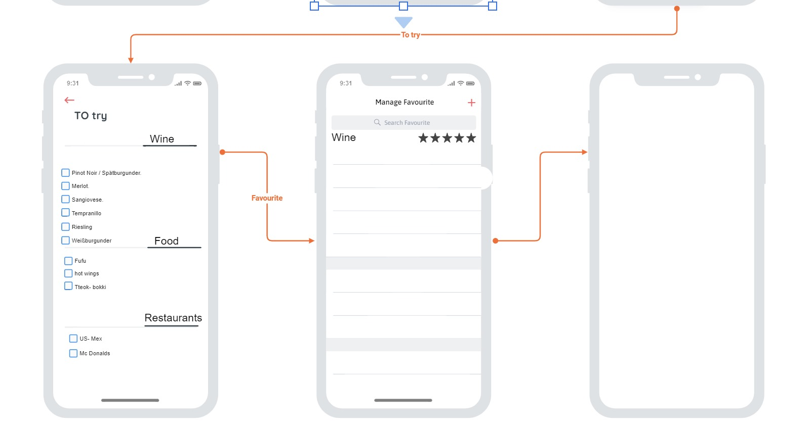

# Persona:
## Zielgruppe:
Foodies und Gourmet-Liebhaber, unabhängig von ihrer ethnischen Gruppe, Geschlecht, Aussehen und Alter

## Bedürfnisse und Merkmale:
- Genießen von Essen und Getränken aus verschiedenen Kulturen und Küchen.
- Die Möglichkeit, ihre Essensvorlieben einfach zu verwalten und abzurufen.
- Teilen von Meinungen und Bewertungen mit anderen Nutzern, um Empfehlungen auszutauschen.
- Geben von Essentipps an Freunde und Familienmitglieder sowie Bereitstellung von Geschenkideen.
- Erfassen persönlicher Bewertungen für zukünftige Referenzen.

## Interessen:
- Erkunden und Bewerten von Gerichten und Getränken aus verschiedenen Restaurants und Orten.
- Einblick in kulinarische Trends und Entdecken neuer Geschmackserlebnisse.
- Schaffen eines persönlichen "Food"-Diarys, um Essenserlebnisse festzuhalten und zu organisieren.
- Teilen von Essenserlebnissen und Empfehlungen mit anderen Nutzern.
- Entdecken und Bewerten von Weinen aus aller Welt, insbesondere für Weinliebhaber.

## Herausforderungen:
- Die Vielfalt der kulinarischen Welt und das Angebot an Gerichten und Getränken können überwältigend sein.
- Schwierigkeiten seine Vorlieben bei der grossen Auswahl im Kopf zu behalten
- Das Bedürfnis nach einfachen und effektiven Möglichkeiten, Essenserlebnisse zu verwalten und zu teilen.
- 

img[alt=drawing] { width: 200px; }

